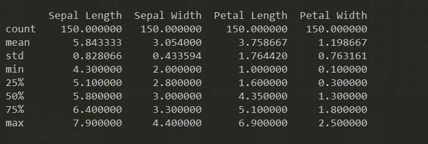

<h1 align ="center">Fisher's Iris Data Set Project 2019</h1>

<p align ="center"></p>

<h2 align ="center">Programming and Scripting Project 2019</h2>
<h2 align ="center">Created by Richard Feeney</h2>
<br>

# Introduction

### Iris Data Set Project Outline And Objectives
<p align ="justify"> The following project is based on the well-known Fisher’s Iris data set. In this project I will use this data set for researching and explaining what it it about and write some Python scripts to backup and explain my findings. The main objectives are as follows</p>

1. Research background information about the data set and write a summary about it. 
1. Keep a list of references I used in completing the project. 
1. Download the data set and write some Python code to investigate it. 
1. Summarise the data set.
1. Write a summary of my investigations. 
1. Include supporting tables and graphics.

<br>

### Project Introduction


<p align="justify">
    <br>
    The Iris Data Set is one of the best known and commonly used datasets that is used by anyone and especially those who wants to develop the skills as they start their journey in the area of Data Science. According to (Kaggle.com, 2019) "The Iris flower data set is a multivariate data set introduced by the British statistician and biologist Ronald Fisher in his 1936 paper The use of multiple measurements in taxonomic problems. It is sometimes called Anderson's Iris data set because Edgar Anderson collected the data to quantify the morphologic variation of Iris flowers of three related species". <br><br> This dataset is a record containing measurements and consists of 50 samples from each of three species of Iris that include the Iris Setosa, Iris virginica, and Iris versicolor. These measurements include the petal lengths & width and the sepal lengths & width. The dataset is often used to demonstrate simple machine learning techniques and became a typical test case for many statistical classification techniques in machine learning.(Archive.ics.uci.edu, 2019)
</p>
<br><br><br>

<p align="center">
    <kbd></kbd>
    <kbd></kbd>
</p>
<br>

### How to view the Iris Dataset

1. Download and install anaconda on your device ( I recommend version 3.7 +).
1. Download and install Visual Studio Code.
1. Download Cmder command line (optional).
1. Go to my repository https://github.com/richardfeeney7/FisherIrisDataSetProject to download the CSV file that contain the data. 
1. Import the required libraries you want to use. I will give a description of the libraries I used later in this document

<br><hr>

# Reading and Printing the CSV File

Once I downloaded the datset I stored it in a file named iris_data_set.csv. I then needed to read that csv file so I can view the contents. 
I originally completed this by using (f = pd.read_csv("iris_data_set.csv")) and this was successful but it didn't display any headings as the
csv file just contains the data. As part of my research I have found a method that will add and output column names. I have written two possible ways to 
output the data set.

```python
    # Load the Pandas Libraries with the alias of pd
    import pandas as pd
    # Load the NumPy Libraries with the alias of np
    import numpy as np

    # When using the below code to view the data wont display headings See the with open section.
    # Update on this is that I had to add a line naming the columns. See line 11.]
    # https://stackoverflow.com/a/34092032/5644281

    '''
    # Load the CSV file
    f = pd.read_csv("iris_data_set.csv")
    f.columns = ['sepal_length', 'sepal_width' , 'petal_length', 'petal_width', 'species'] 

    # Print the contents of the CSV file
    print(f)
    '''
    # I have written the above commented code using with open
    # Open the CSV fine wil headings. 
    with open ("iris_data_set.csv") as ds:
        cols = ["Sepal Length", "Sepal Width" , "Petal Length", "Petal Width", "Species"]
        data = pd.read_csv(ds, names=cols)
    print(data)
```

### Libraries Used

Before starting this project I research some of the best libraries that are available to me. I found a great video that you can find following the link provided <a href ="https://www.youtube.com/watch?v=MqeO9lQemmQ" target="_blank">here</a>. This was a great help to understand some of the most popular packages that are used today by developers. Please find the libraries I have used below. 

* Pandas : Pandas is king when you want to analyzing data using Python and it is one of the most popular tools to use. Pandas is open source for everyone to use. According to (McKinney, 2019) pandas was written by Wes McKinney. He also have a website http://pandas.pydata.org/ that is very useful to gain a better understanding of how and when it is used. Pandas will take in a file like CSV, TSV or SQL database and creates a python object. The important thing to remember is that Pandas is very important for anything that involves data. (YouTube, 2019)

* Numpy : NumPy is another fundamental package that is needed for completing scientific computing tasks using Python. NumPy is used on arrays and the math that goes along with using those arrays for the desired outcome. It is much faster and easier to manipulate these NumPy arrays than the traditional lists and loops that we have used to this point in Python. (Towards Data Science, 2019)

* seaborn : This library is a Python visualization library based on matplotlib and It provides a high-level interface for drawing attractive statistical graphics. The role of Data Analysis is to receive a give set of data and manipulate that data that can be viewed easily or extracting key elements. (DataCamp Community, 2019)

# Summarize the Dataset
<br>

#### Confirm the amount of rows that are in the Data Set. 

Below you will how I used a simple command to confirm that the csv file has the required 150 inputs. 

```python
    # Print the number of rows in the dataset.
    print(data["Species"].count)

```

### Print n number of Rows \ Columns. 

The code below will output n number of rows from the top. In the below example I have specified 10. If no number is entered it will output 5 rows by default. <br>

```python
   # Print the first 10 rows
   print(data.head(10))
```

The line of code below will prink n amount of rows from the end. I have specified 10. If no number is entered it will output 5 rows by default.<br>

```python
    # Just like the finding rows from the beginning, we can also find rows from the end
    print(data.tail(10))
```

We can also check for the number of rows and columns that is in the data set the data contains with the shape property.<br>

```python
    # Display the amount of rows and columns in the set
    print(data.shape)
```

### Group by species

Here I will group the different flowers by species and output the visual representation of each class. <br>

```python
    # Print the unique values of the data set and display the amount of rows in each class
    data['Species'].unique()
    print(data.groupby('Species').size())
```
### Describe the table. 

I have found two ways to find a summary of each attribute. The describe method it better as it is easier for viewing purposes. Both methods are below. 

```python
    # Describe the data (count, mean etc)
    print(data.describe())
    print("\n")

    # Below commented out code does the same as the above describe command but is not visually a good option for 
    # all of them together.
    '''
    print(data.min())
    print(data.max())
    print(data.median())
    print(data.mean())
    print(data.std())
    '''
```
<br>

<p align="center"></p>

### Select Random Rows

It is possible to add random rows from the set. This can be set to output n number of of rows. In my example I have set it to 5  <br>

```python
    # Output n number of random rows from the set
    print(data.sample(5))
```

### NULL Values

Check the data set to see if it contains any null values. I have implemented this in two ways. The first option will display all the rows and contents.   <br>

```python
    # Find if the set has any null values. 
    print(data.isnull())
```

This is the second option and is user friendly as it will group and sum the results 

```python
    # Find if the set has any null values. 
    print(data.isnull().sum())
```

### Find if the set has any null values that are grouped.
```python
    print(data.isnull().sum())
    print("\n")
```

# Visualize the data

In this section I will display visual representation. Just to note that we should always label our axis so people know what we are plotting. 

### Histogram

The histogram is very useful when we want to explore our data and give us an understanding of the distribution of the data set. We can set the bin size
and by default this is set to 10. It is a good idea to change the bin size as it will output the graph in different ways and might potentially display something hidden.
I have used bin=20 and implemented the use of seaborn on the graph too. Seaborn uses the distplot function to create histograms. One thing to note, when creating the 
histograms I used seaborn to set the style with a background grid set to dark and auto set others. This works but has spaces between in the graph. To eliminate this using matplotlib.pyplot (ptl.grid(True)) can be used and no spaces will be displayed. I have kept the seaborn approach but have both options in the code below.
<br>

Histogram based on Sepal Length that is is CM
```python
    # Histagram for Sepal Length
    #plt.grid(True)                # Used sns.set instead to display the grid and set a background color
    sns.set_style("darkgrid")      # Use seaborn on background
    plt.figure(figsize = (10, 7))  # Adjust the size of the graph
    x = data["Sepal Length"]       # Find the Sepal Length and store in x
    # Bin based on Sepal Length
    # Bins are set to 10 by default. I have included is for view purposes
    sns.distplot(x, bins = 20, color = "blue")  # Plot the graph with x, give a color blue  and set the bins using seaborn
    plt.title("Histagram - Sepal Length(cm)")# Title of graph
    plt.xlabel("Sepal_Length_cm")       # Xlabel 
    plt.ylabel("Count")                 # Ylabel
    plt.show()                          # Show graph
```

<br>
Histogram based on Sepal Width that is is CM
```python
    # Histagram for Sepal Width
    #plt.grid(True)                 # Used sns.set instead to display the grid and set a background color
    sns.set()                       # Use default seaborn on background
    plt.figure(figsize = (10, 7))   # Adjust the size of the graph
    x = data["Sepal Width"]         # Find the Sepal Length and store in x
    # Bin based on Sepal Length
    # Bins are set to 10 by default. I have included is for view purposes
    sns.distplot(x, bins = 20, color = "blue")  # Plot the graph with x, give a color blue  and set the bins using seaborn
    plt.title("Histagram- Sepal Width (cm)")# Title of graph
    plt.xlabel("Sepal_width_cm")            # Xlabel 
    plt.ylabel("Count")                     # Ylabel
    plt.show()                              # Show graph
```
<br>

Histogram based on Petal Length that is is CM
```python
    # Histagram for Petal Length
    #plt.grid(True)                 # Used sns.set instead to display the grid and set a background color
    sns.set()                       # Use default seaborn on background
    plt.figure(figsize = (10, 7))   # Adjust the size of the graph
    x = data["Petal Length"]        # Find the Sepal Length and store in x
    # Bin based on Sepal Length
    # Bins are set to 10 by default. I have included is for view purposes
    sns.distplot(x, bins = 20, color = "blue")  # Plot the graph with x, give a color blue  and set the bins using seaborn
    plt.title("Histagram - Petal Length(cm)")# Title of graph
    plt.xlabel("Petal_Length_cm")            # Xlabel 
    plt.ylabel("Count")                     # Ylabel
    plt.show()                              # Show graph     
```
<br>

Histogram based on Petal Width that is is CM
```python
    # Histagram for Petal Width
    #plt.grid(True)                 # Used sns.set instead to display the grid and set a background color
    sns.set()                       # Use default seaborn on background
    plt.figure(figsize = (10, 7))   # Adjust the size of the graph
    x = data["Petal Width"]         # Find the Sepal Length and store in x
    # Bin based on Sepal Length
    # Bins are set to 10 by default. I have included is for view purposes
    sns.distplot(x, bins = 20, color = "blue")  # Plot the graph with x, give a color blue  and set the bins using seaborn
    plt.title("Histagram - Petal Width(cm)")# Title of graph
    plt.xlabel("Petal_Width_cm")            # Xlabel 
    plt.ylabel("Count")                     # Ylabel
    plt.show()                              # Show graph
```

## Box Plot

I have used seaborn to generate a box plot. I have used a different background style on this one. 

```python
    # Box plot. 
    plt.figure(figsize = (10, 7))  # Adjust the size of the graph
    sns.set_style("ticks")      # Use seaborn on background
    plt.title("Box Plot")     # Title of graph
    sns.boxplot(data=data) # Use seaborn to generate a box plot
    plt.show()
```


# Biobliography

1. Medium. (2019). Basic Analysis of the Iris Data set Using Python. [online] Available at: https://medium.com/codebagng/basic-analysis-of-the-iris-data-set-using-python-2995618a6342 [Accessed 16 Mar. 2019].
1. DataFrame, H., Protopopov, A. and Joshi, B. (2019). How to add header row to a pandas DataFrame. [online] Stack Overflow. Available at: https://stackoverflow.com/questions/34091877/how-to-add-header-row-to-a-pandas-dataframe [Accessed 16 Mar. 2019].
1. Holtz, Y. (2019). #104 Seaborn Themes. [online] The Python Graph Gallery. Available at: https://python-graph-gallery.com/104-seaborn-themes/ [Accessed 17 Mar. 2019].
1. Kaggle.com. (2019). Iris Data Analysis and Machine Learning(Python) | Kaggle. [online] Available at: https://www.kaggle.com/gopaltirupur/iris-data-analysis-and-machine-learning-python [Accessed 16 Mar. 2019].
1. Kaggle.com. (2019). Iris Flower Dataset. [online] Available at: https://www.kaggle.com/arshid/iris-flower-dataset [Accessed 16 Mar. 2019].
1. McKinney, W. (2019). About. [online] Wes McKinney. Available at: http://wesmckinney.com/pages/about.html [Accessed 16 Mar. 2019].
1. Towards Data Science. (2019). Numpy Guide for People In a Hurry. [online] Available at: https://towardsdatascience.com/numpy-guide-for-people-in-a-hurry-22232699259f [Accessed 16 Mar. 2019].
1. DataCamp Community. (2019). Python Seaborn Tutorial For Beginners. [online] Available at: https://www.datacamp.com/community/tutorials/seaborn-python-tutorial [Accessed 16 Mar. 2019].
1. YouTube. (2019). Top 14 MOST famous Python libraries & frameworks. [online] Available at: https://www.youtube.com/watch?v=MqeO9lQemmQ [Accessed 16 Mar. 2019].
1. Archive.ics.uci.edu. (2019). UCI Machine Learning Repository: Iris Data Set. [online] Available at: https://archive.ics.uci.edu/ml/datasets/iris [Accessed 16 Mar. 2019].
1. YouTube. (2019). What is Numpy? Python for Data Science tutorial. [online] Available at: https://www.youtube.com/watch?v=pP5dQG0foTs [Accessed 16 Mar. 2019].
1. Seaborn.pydata.org. (2019). seaborn: statistical data visualization — seaborn 0.9.0 documentation. [online] Available at: https://seaborn.pydata.org/ [Accessed 17 Mar. 2019].
1. YouTube. (2019). What is Pandas? Why and How to Use Pandas in Python. [online] Available at: https://www.youtube.com/watch?v=dcqPhpY7tWk [Accessed 16 Mar. 2019].
1. Pandas.pydata.org. (2019). pandas.DataFrame.plot — pandas 0.22.0 documentation. [online] Available at: https://pandas.pydata.org/pandas-docs/version/0.22/generated/pandas.DataFrame.plot.html [Accessed 17 Mar. 2019].
1. Shane Lynn. (2019). The Pandas DataFrame – loading, editing, and viewing data in Python. [online] Available at: https://www.shanelynn.ie/using-pandas-dataframe-creating-editing-viewing-data-in-python/?fbclid=IwAR0cYjeoMSFeqsEwwFTkJsT_OI9Pvr_v4ooj59tZpUnqmZvMYJ0PgQMGYmw [Accessed 16 Mar. 2019].


