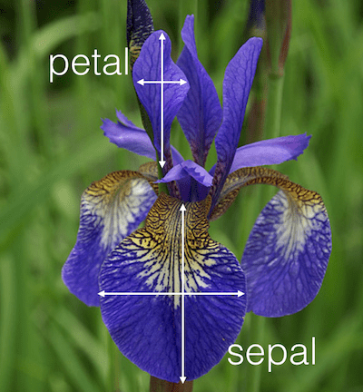

<h1 align ="center">Fisher's Iris Data Set Project 2019</h1>

<h2 align ="center">Programming and Scripting Project 2019</h2>
<h2 align ="center">Created by Richard Feeney</h2>

 

###### Iris Data Set Project Outline And Objectives

 The following project is based on the well-known Fisher’s Iris data set. In this project I will use this data set for researching and explaining what it it about and write some Python scripts to backup and explain my findings. The main objectives are as follows

1. Research background information about the data set and write a summary about it. 
1. Keep a list of references I used in completing the project. 
1. Download the data set and write some Python code to investigate it. 
1. Summarise the data set.
1. Write a summary of my investigations. 
1. Include supporting tables and graphics.

 

###### How to view the Iris Dataset

1. Download and install anaconda on your device ( I recommend version 3.7 +).
1. Download and install Visual Studio Code.
1. Download Cmder command line (optional).
1. Go to my repository https://github.com/richardfeeney7/FisherIrisDataSetProject to download the CSV file that contain the data. 
1. Import the required libraries you want to use. I will give a description of the libraries I used later in this document

#### Project Introduction

     
    The Iris Data Set is one of the best known and commonly used datasets that is used by anyone and especially those who wants to develop the skills as they start their journey in the area of Data Science. According to (Kaggle.com, 2019) "The Iris flower data set is a multivariate data set introduced by the British statistician and biologist Ronald Fisher in his 1936 paper The use of multiple measurements in taxonomic problems. It is sometimes called Anderson's Iris data set because Edgar Anderson collected the data to quantify the morphologic variation of Iris flowers of three related species".    This dataset is a record containing measurements and consists of 50 samples from each of three species of Iris that include the Iris Setosa, Iris virginica, and Iris versicolor. These measurements include the petal lengths & width and the sepal lengths & width. The dataset is often used to demonstrate simple machine learning techniques and became a typical test case for many statistical classification techniques in machine learning.(Archive.ics.uci.edu, 2019)

 
 
 

    <kbd></kbd>
    <kbd></kbd>

 

#### Libraries Used

Before starting this project I research some of the best libraries that are available to me. I found a great video that you can find following the link provided <a href ="https://www.youtube.com/watch?v=MqeO9lQemmQ" target="_blank">here</a>. This was a great help to understand some of the most popular packages that are used today by developers. Please find the libraries I have used below. 

* Pandas : Pandas is king when you want to analyzing data using Python and it is one of the most popular tools to use. Pandas is open source for everyone to use. According to (McKinney, 2019) pandas was written by Wes McKinney. He also have a website http://pandas.pydata.org/ that is very useful to gain a better understanding of how and when it is used. Pandas will take in a file like CSV, TSV or SQL database and creates a python object. The important thing to remember is that Pandas is very important for anything that involves data. (YouTube, 2019)

*Numpy : NumPy is another fundamental package that is needed for completing scientific computing tasks using Python. NumPy is used on arrays and the math that goes along with using those arrays for the desired outcome. It is much faster and easier to manipulate these NumPy arrays than the traditional lists and loops that we have used to this point in Python. (Towards Data Science, 2019)

 

#### Reading and Printing the CSV File

''' Python
    # Load the Pandas Libraries with the alias of pd
import pandas as pd
# Load the NumPy Libraries with the alias of np
import numpy as np

#When using the below code to view the data will work but wont have headings See the with open section for the update. 
#Update on this is that I had to add a line naming the columns. See line 11 
'''
# Load the CSV file
f = pd.read_csv("iris_data_set.csv")
f.columns = ['sepal_length', 'sepal_width' , 'petal_length', 'petal_width', 'species']  Refereance : (DataFrame, Protopopov and Joshi, 2019)

# Print the contents of the CSV file
print(f)
'''

# Open the CSV fine wil headings. 
with open ("iris_data_set.csv") as ds:
    cols = ["Sepal Length", "Sepal Width" , "Petal Length", "Petal Width", "Species"]
    data = pd.read_csv(ds, names=cols)
print(data)

'''

# Biobliography

1. DataFrame, H., Protopopov, A. and Joshi, B. (2019). How to add header row to a pandas DataFrame. [online] Stack Overflow. Available at: https://stackoverflow.com/questions/34091877/how-to-add-header-row-to-a-pandas-dataframe [Accessed 16 Mar. 2019].
1. Kaggle.com. (2019). Iris Flower Dataset. [online] Available at: https://www.kaggle.com/arshid/iris-flower-dataset [Accessed 16 Mar. 2019].
1. McKinney, W. (2019). About. [online] Wes McKinney. Available at: http://wesmckinney.com/pages/about.html [Accessed 16 Mar. 2019].
1. Towards Data Science. (2019). Numpy Guide for People In a Hurry. [online] Available at: https://towardsdatascience.com/numpy-guide-for-people-in-a-hurry-22232699259f [Accessed 16 Mar. 2019].
1. YouTube. (2019). Top 14 MOST famous Python libraries & frameworks. [online] Available at: https://www.youtube.com/watch?v=MqeO9lQemmQ [Accessed 16 Mar. 2019].
1. Archive.ics.uci.edu. (2019). UCI Machine Learning Repository: Iris Data Set. [online] Available at: https://archive.ics.uci.edu/ml/datasets/iris [Accessed 16 Mar. 2019].
1. YouTube. (2019). What is Numpy? Python for Data Science tutorial. [online] Available at: https://www.youtube.com/watch?v=pP5dQG0foTs [Accessed 16 Mar. 2019].
1. YouTube. (2019). What is Pandas? Why and How to Use Pandas in Python. [online] Available at: https://www.youtube.com/watch?v=dcqPhpY7tWk [Accessed 16 Mar. 2019].

